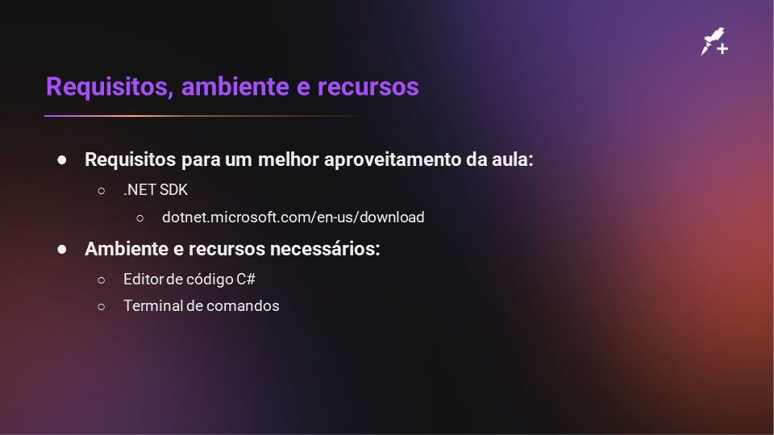
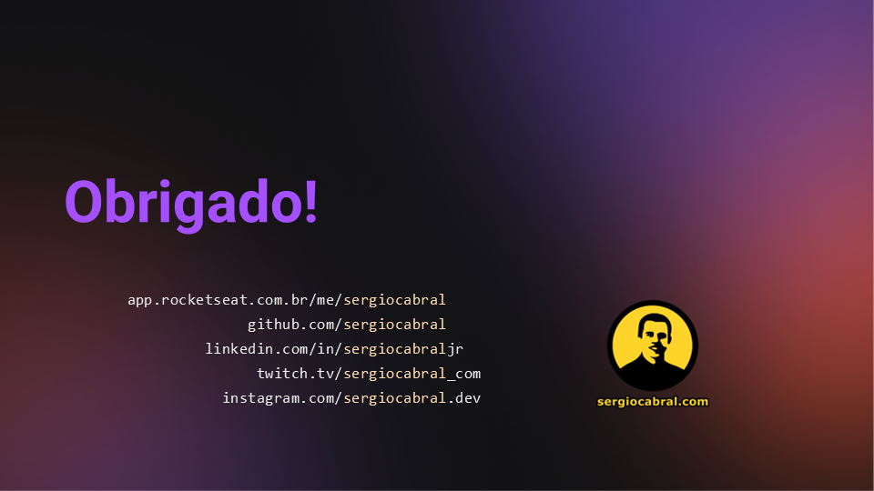

# Sample.CSharpNETCore.TelnetClientServer

Este repositório contem uma aplicação cliente/servidor baseado em telnet.

## Como Servidor

Você escolhe qual aplicação de linha de comando servir.

Por padrão o *Prompt do Windows* (`cmd.exe`) é servido na porta `23` usando:

```
TelnetClientServer.exe --server
```

Para ajustar os parâmetros, como ter o *PowerShell* (`pwsh.exe`) na porta `6500`, use:

```
TelnetClientServer.exe --server pwsh.exe:6500
```

## Como Cliente

Este é o modo padrão de execução, quando usado sem parâmetros.
Ele tenta conectar em `localhost` na porta `23`:

```
TelnetClientServer.exe
```

Para ajustar o servidor e porta de destino, por exemplo `telnet.service.sergiocabral.com` e `1025`, use:

```
TelnetClientServer.exe telnet.service.sergiocabral.com:1025
```

## Slides da aula






## Rocketseat+

| [](https://github.com/sergiocabral) |
| :-: |
|[sergiocabral.com](https://sergiocabral.com)|
